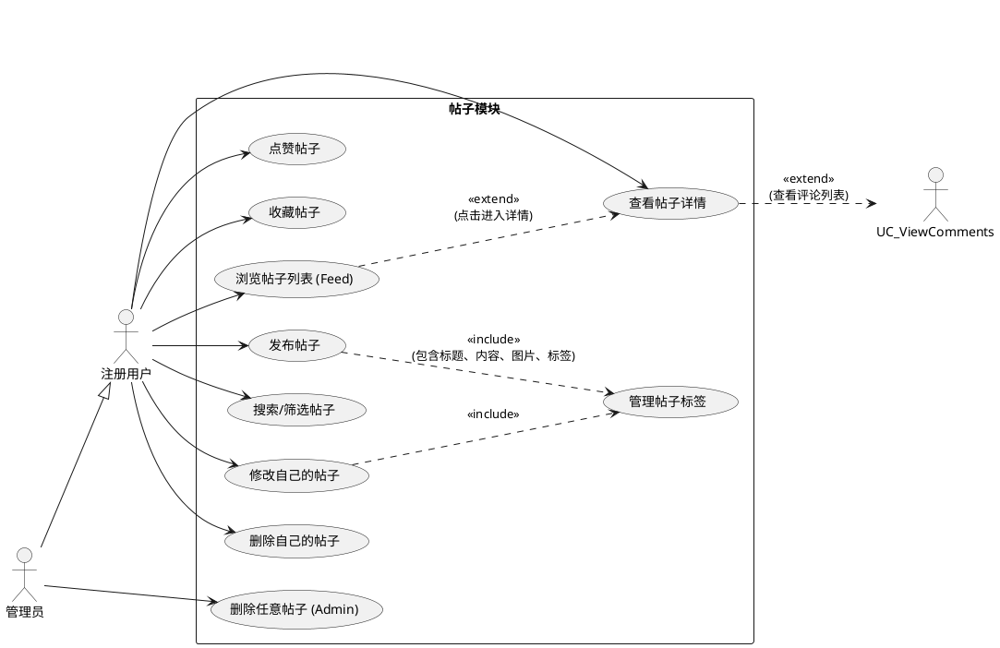
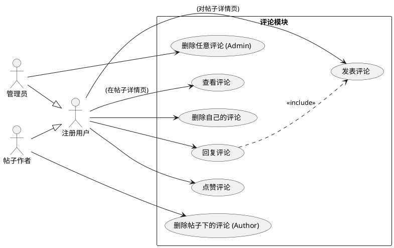
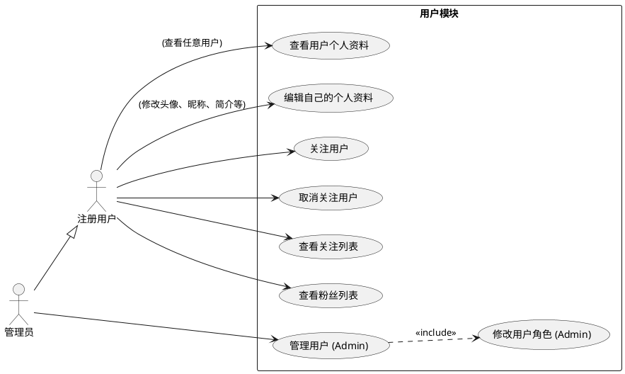
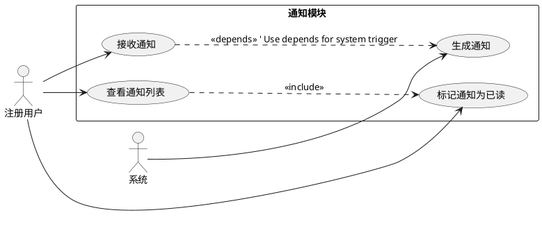

请完善下面的用例图：
帖子模块:
(1)	发布帖子:用户登录后，可发布包含标题、文字描述、至少一张图片、关联标签的帖子。
(2)	浏览帖子:
(3)	列表浏览:在首页或特定板块以瀑布流/卡片列表形式展示帖子。
(4)	详情浏览:点击帖子进入详情页，查看完整内容、图片、作者信息、评论列表。
(5)	搜索/筛选:支持通过关键词搜索帖子，或根据标签筛选帖子。
(6)	修改帖子:作者可以修改自己发布的帖子内容。
(7)	删除帖子:作者可以删除自己发布的帖子。
(8)	点赞/收藏帖子:用户可以对感兴趣的帖子进行点赞或收藏。

评论模块:
(1)	发表评论:用户可以对帖子详情页发表评论。
(2)	查看评论:在帖子详情页查看该帖子的所有评论。
(3)	删除评论:评论发布者或帖子作者/管理员可以删除评论。

用户模块:
(1)	个人主页:查看任意用户的基本信息、发布的帖子列表、关注/粉丝列表。
(2)	编辑个人资料:用户可以修改自己的头像、昵称、个人简介等信息。
(3)	关注/取关用户:用户可以关注其他感兴趣的用户，也可以取消关注。
(4)	查看关注/粉丝:用户可以查看自己关注的人和关注自己的人列表。

## 2. 用例图 (Use Case Diagrams)

### 2.1 帖子模块



### 2.2 评论模块



### 2.3 用户模块



### 2.4 用户认证与授权模块 (保持不变)

@startuml
top to bottom direction

actor 游客 as Guest
actor "注册用户" as RegisteredUser

rectangle "用户认证与授权" {
  usecase "注册账户" as UC_Register
  usecase "登录系统" as UC_Login
  usecase "发送密码重置码" as UC_SendResetCode
  usecase "重置密码" as UC_ResetPassword
  usecase "验证邮箱" as UC_VerifyEmail
  usecase "重新发送验证邮件" as UC_ResendVerification
  usecase "获取当前用户信息" as UC_GetMe
  usecase "登出系统" as UC_Logout
}

Guest --> UC_Register
Guest --> UC_Login
Guest --> UC_SendResetCode
Guest --> UC_ResetPassword

RegisteredUser --> UC_Login
RegisteredUser --> UC_SendResetCode
RegisteredUser --> UC_ResetPassword
RegisteredUser --> UC_VerifyEmail
RegisteredUser --> UC_ResendVerification
RegisteredUser --> UC_GetMe
RegisteredUser --> UC_Logout

UC_ResetPassword ..> UC_SendResetCode : <<include>>
UC_Register ..> UC_VerifyEmail : <<extend>>
UC_Register ..> UC_ResendVerification : <<extend>>

@enduml

### 2.5 通知模块 (保持不变)



### 2.6 管理后台模块 (可能需要根据上述细化用例进行调整，暂时保持)

```plantuml
@startuml
left to right direction

actor "管理员" as Admin

rectangle "管理后台模块" {
  usecase "登录管理后台" as UC_AdminLogin
  usecase "用户管理" as UC_UserMgmt
  usecase "帖子管理" as UC_PostMgmt
  usecase "评论管理" as UC_CommentMgmt
  usecase "标签管理 (PostTag, FoodTag)" as UC_TagMgmt
  usecase "Food Showcase 管理" as UC_ShowcaseMgmt
  usecase "查看用户列表" as UC_ViewUserList
  usecase "查看用户详情" as UC_ViewUserDetail
  usecase "修改用户角色" as UC_ModifyRoleAdmin
  usecase "禁用/启用用户" as UC_ToggleUserStatusAdmin ' As noted, Schema lacks direct status
  usecase "查看帖子列表" as UC_ViewPostListAdmin
  usecase "删除帖子" as UC_DeletePostAdmin
  usecase "查看评论列表" as UC_ViewCommentListAdmin
  usecase "删除评论" as UC_DeleteCommentAdmin
  usecase "查看/添加/删除标签" as UC_ManageTagsAdmin
  usecase "查看/添加/编辑/删除Showcase" as UC_ManageShowcaseAdmin

}

Admin --> UC_AdminLogin
Admin --> UC_UserMgmt
Admin --> UC_PostMgmt
Admin --> UC_CommentMgmt
Admin --> UC_TagMgmt
Admin --> UC_ShowcaseMgmt

UC_UserMgmt ..> UC_ViewUserList : <<include>>
UC_UserMgmt ..> UC_ViewUserDetail : <<include>>
UC_UserMgmt ..> UC_ModifyRoleAdmin : <<include>>
' UC_UserMgmt ..> UC_ToggleUserStatusAdmin : <<include>> ' Commented out due to schema

UC_PostMgmt ..> UC_ViewPostListAdmin : <<include>>
UC_PostMgmt ..> UC_DeletePostAdmin : <<include>> ' Corresponds to UC_DeleteAnyPost

UC_CommentMgmt ..> UC_ViewCommentListAdmin : <<include>>
UC_CommentMgmt ..> UC_DeleteCommentAdmin : <<include>> ' Corresponds to UC_DeleteAnyCommentByAdmin

UC_TagMgmt ..> UC_ManageTagsAdmin : <<include>>
UC_ShowcaseMgmt ..> UC_ManageShowcaseAdmin : <<include>>

@enduml
```

